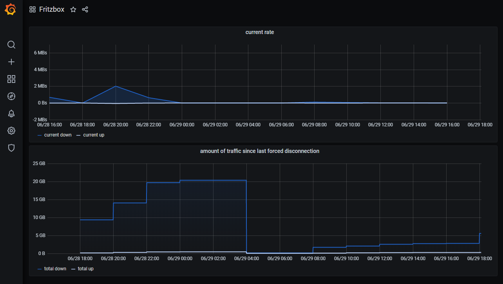

# Fritzbox WAN traffic monitoring

It fetches:
* the current up/down throughput  
* total amount of up/down traffic since the last forced DSL disconnection  

and writes it to a InfluxDB database

 
 

example visualisation

